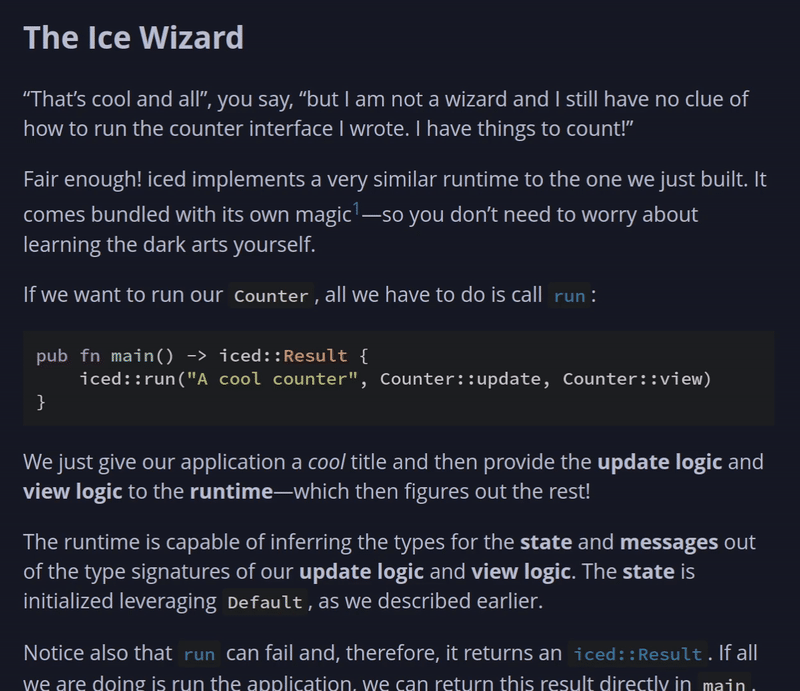

<div align="center">


# mdbook-iced

[](https://docs.rs/mdbook-iced)
[](https://crates.io/crates/mdbook-iced)
[](https://github.com/iced-rs/mdbook-iced/blob/master/LICENSE)
[](https://crates.io/crates/mdbook-iced)
[](https://github.com/iced-rs/mdbook-iced/actions)
[](https://discourse.iced.rs/)
[](https://discord.gg/3xZJ65GAhd)

An mdBook preprocessor to turn [iced] code blocks into interactive examples.



</div>

## Overview
This is a simple mdBook preprocessor that can add a play button to any [iced] code block.

Pressing the play button loads and embeds the resulting Wasm application in a fully interactive `<canvas>` right under the code block.

It is compatible with any code block that features a `main` function where an [iced] program is run—even if it is hidden! This means
it can be used to create interactive examples even for books completely unrelated to [iced].

Currently, this preprocessor is mainly being used in [the official guide] to [iced]. Check it out!

## Installation
Install the `mdbook-iced` preprocessor and the [`wasm-bindgen-cli`] tool with `cargo install`:

```
cargo install mdbook-iced wasm-bindgen-cli
```

Also, make sure your toolchain has the `wasm32-unknown-unknown` target:

```
rustup target add wasm32-unknown-unknown
```

## Usage
Add a `[preprocessor.iced]` entry to your `book.toml` and specify the revision of `iced` your book will use:

```toml
[preprocessor.iced]
# You can use a commit hash
rev = "9db6ac8f202ebdc1453edee01da0b30aee0949d8"
# ... a branch
branch = "master"
# ... or a tag!
tag = "0.13.0" # Not yet released!
```

Then, simply add an `iced` label to any executable code block you want to make playable. For instance, the
classical counter:

````markdown
# A cool example

This is an mdBook and here is an iced counter:

```rust,ignore,iced
# use iced::widget::{button, column, text, Column};
#
pub fn main() -> iced::Result {
    iced::run(update, view)
}
# 
# #[derive(Debug, Clone)]
# enum Message {
#     Increment,
# }
# 
# fn update(value: &mut u64, message: Message) {
#     match message {
#         Message::Increment => *value += 1,
#     }
# }
# 
# fn view(value: &u64) -> Column<'_, Message> {
#     column![
#         text(value),
#         button("+").on_press(Message::Increment),
#     ]
# }
```
````

This produces the following code block:

```rust,ignore,iced
# use iced::widget::{button, column, text, Column};
#
pub fn main() -> iced::Result {
    iced::run(update, view)
}
# 
# #[derive(Debug, Clone)]
# enum Message {
#     Increment,
# }
# 
# fn update(value: &mut u64, message: Message) {
#     match message {
#         Message::Increment => *value += 1,
#     }
# }
# 
# fn view(value: &u64) -> Column<'_, Message> {
#     column![
#         text(value),
#         button("+").on_press(Message::Increment),
#     ]
# }
```

You can control the height of the embedded application by using `iced(height=<pixels>)` as a label (e.g. `iced(height=100)`).
For instance:

```rust,ignore,iced(height=100)
# use iced::widget::{button, column, text, Column};
#
pub fn main() -> iced::Result {
    iced::run(update, view)
}
# 
# #[derive(Debug, Clone)]
# enum Message {
#     Decrement,
# }
# 
# fn update(value: &mut i64, message: Message) {
#     match message {
#         Message::Decrement => *value -= 1,
#     }
# }
# 
# fn view(value: &i64) -> Column<'_, Message> {
#     column![
#         text(value),
#         button("-").on_press(Message::Decrement),
#     ]
# }
```

[iced]: https://github.com/iced-rs/iced
[`wasm-bindgen-cli`]: https://rustwasm.github.io/wasm-bindgen/reference/cli.html
[the official guide]: https://book.iced.rs/
